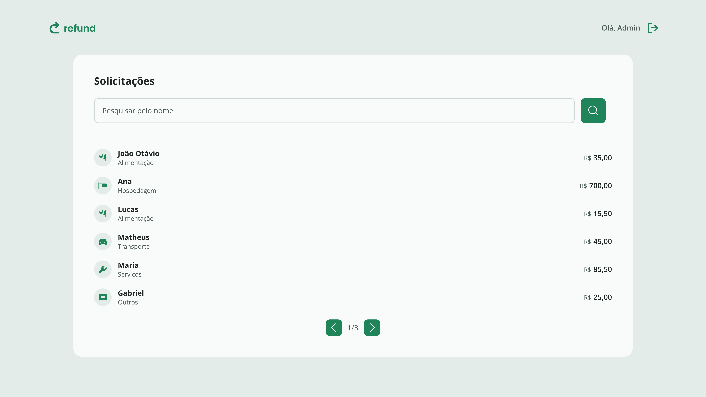

<h1 align="center"> Refund</h1>

<p align="center">💸 Interface web moderna para gerenciamento de pedidos de reembolso, desenvolvida com React, TypeScript e TailwindCSS.
  <br/><br/>
  
  
  
</p>

<p align="center">
  
</p>

## 📑 Índice

- [📖 Visão Geral](#-visão-geral)
- [🛠️ Tecnologias Utilizadas](#️-tecnologias-utilizadas)
- [⚙️ Funcionalidades](#️-funcionalidades)
- [🚀 Como Executar o Projeto](#-como-executar-o-projeto)
  - [📋 Pré-requisitos](#-pré-requisitos)
  - [🔧 Instalação](#-instalação)
  - [▶️ Execução](#️-execução)
- [🌐 API Back-End](#-api-back-end)
- [🤝 Contribuições](#-contribuições)
- [⭐ Apoie este Projeto](#-apoie-este-projeto)
- [📞 Contato](#-contato)

## 📖 Visão Geral

Refund é uma aplicação completa para gerenciamento de pedidos de reembolso, permitindo que usuários realizem solicitações e que administradores acompanhem e gerenciem os pedidos com facilidade. Este repositório contém o front-end da aplicação, construído com React, TypeScript e TailwindCSS, oferecendo uma experiência moderna e intuitiva para os usuários.

## 🛠️ Tecnologias Utilizadas

- ⚛️ React – Biblioteca JavaScript para interfaces.
- ⚡ Vite – Build tool ultrarrápida.
- 🟦 TypeScript – Tipagem estática para JavaScript.
- 🎨 TailwindCSS – Estilização com utilitários CSS.
- 💎 Zod – Validação de dados.
- 🧹 ESLint – Análise estática e padronização de código.
- 📦 Axios – Requisições HTTP.
- 🧩 Lucide – Ícones modernos via React.

## ⚙️ Funcionalidades

- **👤 Criar usuário**: Registra um novo usuário na aplicação.
- **🔐 Login**: Autentica um usuário e retorna um token JWT.

- **💸 Criar pedido de reembolso**: Cadastra uma nova solicitação com dados e comprovante.
- **📋 Listar reembolsos**: Retorna todos os reembolsos solicitados pelo usuário.
- **🔎 Visualizar reembolso por ID**: Detalha um reembolso específico.

- **📤 Enviar arquivos**: Realiza upload de arquivos como comprovantes de reembolso.
- **🔗 Buscar arquivos por ID**: Retorna o arquivo enviado.

## 🚀 Como Executar o Projeto

### 📋 Pré-requisitos

- 🟩 [Node.js 20](https://nodejs.org/en/download/)
- 📦 [npm 10](https://www.npmjs.com/)

### 🔧 Instalação

1. Clone o repositório:

    ```bash
    git clone https://github.com/joschonarth/refund-web.git
    ```

2. Acesse o diretório do projeto:

    ```bash
    cd refund-web
    ```

3. Instale as dependências:

    ```bash
    npm install
    ```

### ▶️ Execução

Inicie a aplicação:

  ```bash
  npm run dev
  ```

A aplicação estará disponível em: [http://localhost:5173](http://localhost:5173)

## 🌐 API Back-End

A interface web do **Refund** se comunica com uma **API RESTful** robusta, responsável por autenticação, gerenciamento dos pedidos e armazenamento de arquivos. O back-end da aplicação foi desenvolvido com Node.js e TypeScript, utilizando uma arquitetura modular e segura.

👉 Acesse o repositório do back-end [aqui](https://github.com/joschonarth/refund-api).

## 🤝 Contribuições

Contribuições são bem-vindas! Sinta-se à vontade para abrir issues ou pull requests com melhorias ou correções.

## ⭐ Apoie este Projeto

Se este projeto te ajudou ou te inspirou de alguma forma, não esqueça de deixar uma ⭐ no repositório! Isso faz toda a diferença! 🚀

## 📞 Contato

[](https://www.linkedin.com/in/joschonarth/)
[](mailto:joschonarth@gmail.com)
